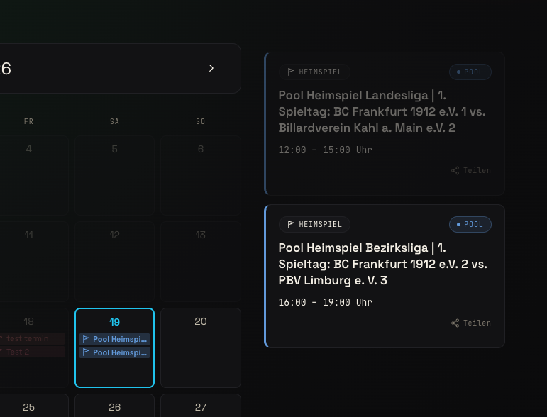

-> translations -> mobile version -> Spacing bei EN/DN

# Todos before first release

## Bigger sections

Mitgliedschaft Subpage gestalten -> BCF Files hinterlegen (Satzung, Datenschutzerklärung)
(Eraldo) Disziplinen Section gestalten
(Eraldo) Vereinsheim Section gestalten
Mobile Layout (Breakpoints, Nav(Hamburger))
Cookie Banner
Datenschutz Subpage
File Struktur aufräumen + sectionnumbers prüfen + alle Bindestriche aus in DE und EN (ganz am Ende)

## kleinere todos oder bugfixes

Mobile Version:

- readArtikel-fenster auf Handy testen
- Burger Menu Ausklapp Style ändern in Glass
- DE Button Navbar
- Navbar Schriftzug zentriert
- Subpages anpassen
- Hero Page: 1912 Schriftzug größer
- sind die Kalender Punkte in richtiger Farbe
- Email Crawler

## With Sydney

text content drüber schauen und bearbeiten
Disciplines (Karambol, Pool, Snooker) echte Beschreibungen
Mitgliedschaftstexte überarbeiten (selber gucken auf alter Seite)
Platzhalter Mail durch echte Mails ersetzen
regelmäßiges training mit Trainern in allen Sparten erwähnen?
Termin Datenbank füllen mit ihm zusammen (Newsbeiträge, Mannschaftstrainings, Trainings mit David, Turniere)
exisiteren diese Emailadressen?
sind diese Satzungen noch aktuell? Richtige Satzungen hinterlegen
mitgliederanzahl auf hero prüfen "240+ Mitglieder"
Impressum & Vorstand Subpage ergänzen

# GoLive

klappt alles mit den Admin Accounts?
learn about Vercel Analysis Interface, how does it work?
vercel einrichten, Wie viel wird das kosten
env vars einrichten
dns umzeigen, wie läuft das jetzt gerade? Wie kriegen wird die Url?
Cronjob aktivieren
darf ich überhaupt fetchen?
SSL Zertifikat
XML Sitemaps und robots.txt (Was ist das?)
Privater Storage-Bucket für Entwurfs-bilder (Aktuell sind Bilder unveröffentlichter Beiträge über direkte URL abrufbar)
Cookie und Datenschutz Hinweise einbauen
Was ist mit Bildrechten? Oder Bausteine der Website oder Programmierbausteine der Website?
Impressum Seite legalmachen
Resend eigene Domain verifizieren (E-Mails kommen aktuell von onboarding@resend.dev und landen im Spam — eigene Adresse wie noreply@bcfrankfurt.de einrichten, braucht DNS-Zugriff)
mein eigenes Passwort ändern
HSTS (Strict-Transport-Security) — besser direkt bei Vercel setzen sobald du live bist
Datenschutzerklärung aktualisieren

# Second release

## bigger ideas

Record Hero Video
Record Discipline Video
Vorstand Bilder
Vorstandspage gestalten
Verheinshistorie Page gestalten
Sportbetrieb und Mannschaften Page gestalten
CueSore Tournament Import aktivieren (?)
CueScore Score and Ranking Board
Admin Dashboard: dynamische Storage Anzeige
Admin Dashboard: DE/EN Übersetzung
Was ist Seo? How do i use it the best way? How can i integrate it more?

## little things

Admin Dashboard: Veranstaltungen Tabelle in Termine umbenennen
Admin Dashboard: Austragungsort kann anders eingetragen werden, hat aber keine Auswirkungen
auto testtabelle in Supabase löschen
Admin Dashboard: Bug "+ Neuer Termin" Btn veschwindet bei 0 Einträgen
Bug News-Card Hover-farblicher Streifen unten
Admin Dashboard: Edit Modal "Änderungen speichern" nur aktiv wenn Feld geändert
Was passiert bei keinen news Beiträgen
DB-Spaltenbreiten mit App-Validierung synchronisieren (Zeichenlimits in DB und Admin-Formular müssen immer übereinstimmen — wenn eins geändert wird, das andere auch anpassen)
News-Artikel Detailseiten /beitraege/[slug] (eigene Unterseite pro Artikel bauen, auf der der volle Text zu lesen ist)
Galerie-Bilder EXIF-Rotation korrigieren (Handy-Fotos sind manchmal falsch gedreht gespeichert — beim Upload automatisch korrekt ausrichten)
Scrolling Banner verbessern (Marquee schneller machen und nahtlosen Loop ohne sichtbaren Sprung einbauen)
Zeilenumsprung wenn auf EN geschaltet -> Upcoming Tournaments
Termin teilen Funktion editieren wegen Whatsapp
Scrolling Bug (von Subpage direkt auf Navbarlink)
 ab wann werden alte veranstalungen so ausgeblendet?

## Other

Google Eintrag
Sunday Breakout Poster

## Security

⚠️ Eine bekannte Schwäche bleibt: IP-Spoofing über verteilte Botnetze (viele verschiedene IPs) wird dadurch nicht gestoppt. Das ist die Grenze dieses Ansatzes — dagegen hilft nur CAPTCHA. Für einen internen Club-Admin ist das aber ein realistisch vernachlässigbares Szenario.

⚠️ Cold Starts auf Vercel — ein neuer Lambda-Start setzt den Store zurück. Das ist die inhärente Schwäche von In-Memory bei Serverless. Supabase Auth's eigene Rate Limits sind der Fallback.

dangerouslySetInnerHTML bei Admin prüfen
dangerouslySetInnerHTML bei News Aritkel Popup Fenster prüfen
